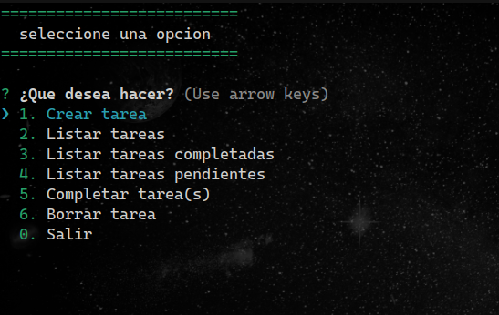

# app tareas en consola

#### proyecto sacado de: [Legacy - Node: De cero a experto](https://www.udemy.com/course/node-de-cero-a-experto/)

## Ejecuta el programa localmente

### Clona el proyecto con git 🖥️

```bash
  git clone https://github.com/elsemooo/app-de-tareas-en-consola.git
```

### Navega hasta el proyecto 🚀

```bash
  cd  app-de-tareas-en-consola
```

### Instala dependencias con npm

```bash
  npm install
```

---

## o

### Instala dependecias con yarn 🐈‍⬛

```bash
  yarn
```

### Ejecutar el programa

```bash
  node app.js
```

## Screenshots

inicio:



## Agradecimientos

-   [Legacy - Node: De cero a experto](https://www.udemy.com/course/node-de-cero-a-experto/)
